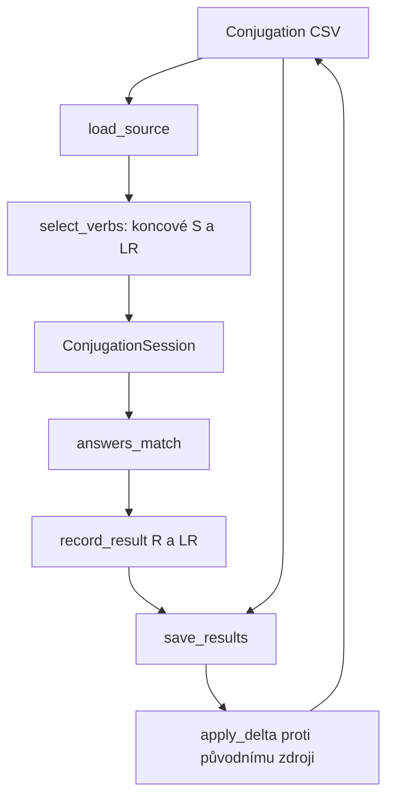

# Workflow časování

```mermaid
flowchart TD
    CSV["Conjugation CSV"] --> Source["load_source"]
    Source --> Select["select_verbs: koncové S a LR"]
    Select --> Session["ConjugationSession"]
    Session --> Compare["answers_match"]
    Compare --> R["record_result R a LR"]
    R --> Save["save_results"]
    CSV --> Save
    Save --> Delta["apply_delta proti původnímu zdroji"]
    Delta --> CSV
```

Souvislosti a omezení: [architektura](../ARCHITECTURE.md), [datové smlouvy](../DATA_STORAGE.md), [GUI](../GUI.md).
